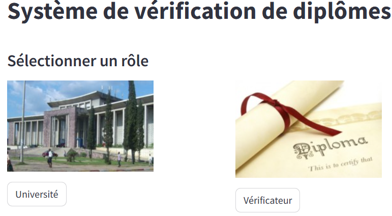
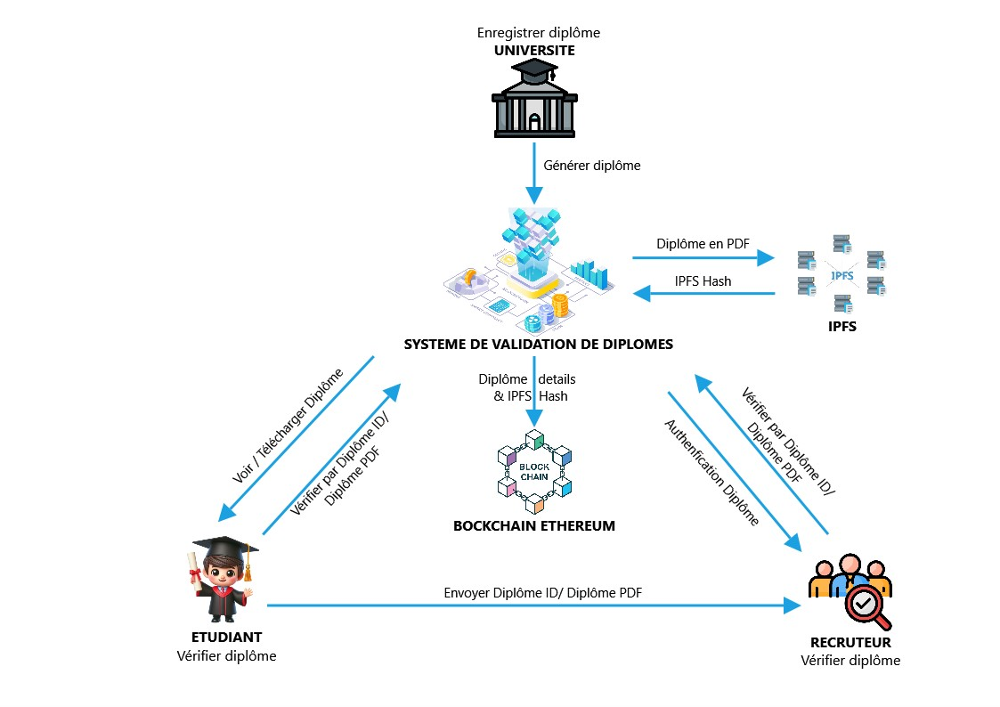
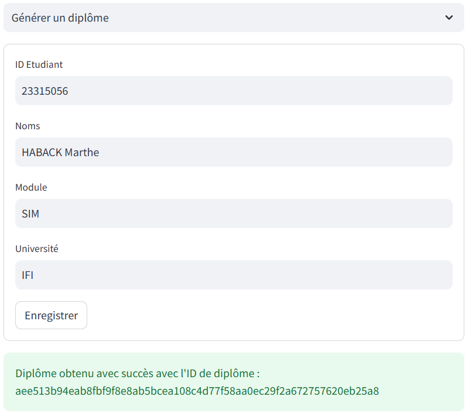
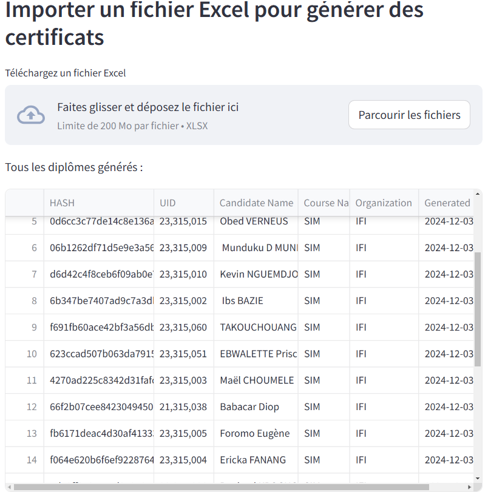
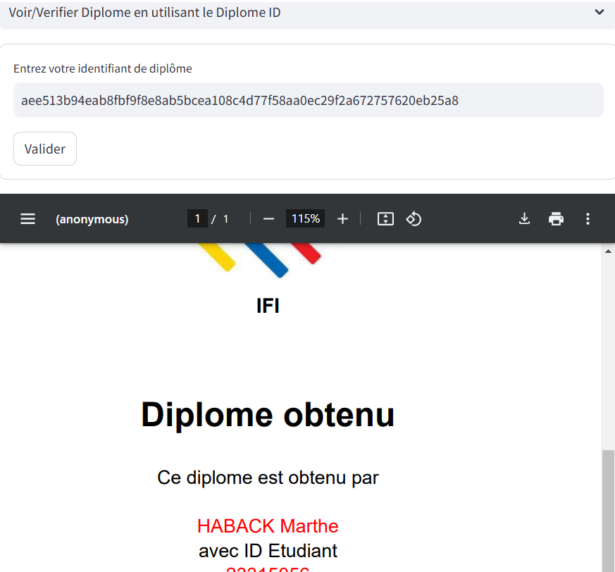

# Système de vérification et de validation des diplômes

<p align="center">
  <a href="#Description">Description</a> •
  <a href="#Fonctionnalités">Fonctionnalités</a> •
  <a href="#Technologies-utilisées">Technologies utilisées</a> •
  <a href="#Installation">Installation</a> •
  <a href="#Utilisation">Utilisation</a> •
  <a href="#Architecture-du-système">Architecture du système</a> •
  <a href="#Tests">Tests</a>
</p>


## 🚩 Description
Ce projet met en œuvre un système basé sur la blockchain pour valider et authentifier les diplômes universitaires. Il répond aux défis des méthodes traditionnelles en fournissant une solution sécurisée, transparente et décentralisée. Les universités peuvent générer, enregistrer et vérifier les diplômes universitaires via la blockchain Ethereum, garantissant ainsi l'authenticité et la résistance à la fraude.




## 🎨 Fonctionnalités
- **Dossiers sécurisés et immuables** : les diplômes sont stockés sur un registre décentralisé.
- **Signature numérique** : garantit l'authenticité des documents.
- **Intégration IPFS** : stockage de fichiers décentralisé à l'aide du système de fichiers interplanétaire.
- **Contrats intelligents** : validation et enregistrement automatisés des données.
- **Interface conviviale** : accès simplifié pour les universités et les vérificateurs.

- 

## 🤖 Technologies utilisées
- **Plateforme Blockchain** : Ethereum
- **Langage de programmation** : Solidity, Python
- **Système de stockage** : IPFS (via Pinata)
- **Frontend** : Streamlit, HTML, CSS, JavaScript
- **Backend** : Node.js
- **Stockage** : IPFS avec Pinata comme client (pour stocker les diplômes au format pdf de manière décentralisée)


## 🚀 Installation

### Prérequis
- Node.js et npm installés avec une version >= 21.0.0
- Version Python >= 3.9.10 (La version Python 3.9.10 ou supérieure est recommandée mais d'autres versions peuvent également fonctionner.)
- Compte Pinata pour la gestion IPFS

### Étapes
1. Cloner le dépôt :
```bash
git clone https://github.com/DavidLUTALA/Systeme-de-verification-et-de-validation-des-diplomes.git
```
```bash
cd Systeme-de-verification-et-de-validation-des-diplomes
```

2. Installer les dépendances : 
- **Paquets installés globalement pour Truffle et Ganache-cli**
```bash
npm install -g truffle
```
```bash
npm install -g ganache-cli
```
- **Paquets Python**
Dans le répertoire racine du projet, exécutez la commande :
```bash
pip install pdfplumber
```
```bash
pip install Pillow
```
```bash
pip install Pyrebase4
```
```bash
pip install python-dotenv
```
```bash
pip install reportlab
```
```bash
pip install requests
```
```bash
pip install streamlit
```
```bash
pip install streamlit_extras
```
```bash
pip install web3
```

3. Exécution du projet

- **Ouvrez un terminal et démarrez la blockchain Ganache avec la commande :**
```bash
ganache-cli -h 127.0.0.1 -p 8545
```

- **Ouvrez un nouveau terminal dans le répertoire racine du projet et exécutez la commande suivante pour compiler et déployer les contrats intelligents.**
```bash
truffle migrate
```

- **Changez du répertoire de travail vers le répertoire d'application à l'intérieur du répertoire racine du projet.**
```bash
cd application
```

- **Lancez l'application Streamlit.**
```bash
streamlit run app.py
```

- Vous pouvez maintenant visualiser l'application sur votre navigateur exécutée sur **localhost:8501**

Pour arrêter l'application, appuyez sur **Ctrl+C**

## 🐾 Utilisation
1. **Université** :
- Téléchargez les détails du diplôme.
- Générez un PDF signé et stockez-le sur IPFS.
- Enregistrez la transaction sur la blockchain.
2. **Vérificateur** :
- Saisissez l'ID du diplôme ou téléchargez le fichier du diplôme.
- Vérifiez son authenticité en faisant correspondre le hachage.

## 🔧 Architecture du système
- **Frontend** : fournit des interfaces utilisateur pour les universités et les vérificateurs.
- **Backend** : gère les interactions avec IPFS et la blockchain Ethereum.
- **Smart Contract** : gère le stockage sécurisé et immuable des données des diplômes.



## 📦 Tests
- **Évaluation de l'utilisabilité** : Une évaluation basée sur l'échelle SUS (System Usability Scale) a révélé  une excellente convivialité, avec un score de 77,1, indiquant que les utilisateurs trouvent le syste me facile à utiliser et satisfaisant.
- **Analyse des performances** :

| TEST | Valeur |
| --- | --- |
| Temps de confirmation moyen | 10 secondes |
| Coût de transaction moyen | 0,0001415 ETH (0,51 USD) |

## 💬 Améliorations futures
- Optimisation des coûts de transaction.
- Intégration aux systèmes de gestion pédagogique existants.
- Prise en charge de types de justificatifs supplémentaires (par exemple, certificats de participation).
- Validations à grande échelle avec plusieurs institutions.

## 📜 Licence
Ce projet est sous licence [MIT License](LICENSE) © [David Lutala](https://github.com/DavidLUTALA).
## Contributing
We welcome contributions! Please refer to the [CONTRIBUTING.md](CONTRIBUTING.md) file for details.

## 🌏 Contact
Pour toute question ou suggestion, veuillez me contacter par mail via [davidlutala0@gmail.com].
- **Author**: [David Lutala](davidlutala0@gmail.com)
- **GitHub**: [DavidLUTALA](https://github.com/DavidLUTALA)


## Photos du système

- génération diplôme par l'université


- Affichage de la liste de tous les diplômes générés (Assurer la transparence)


- génération par importation d'un fichier excel (qui facilite la tâche aux universités en téléversant la liste des diplômes à partir d'un fichier excel)


- Différentes méthodes de vérification


- Vérification par fichier PDF


- Vérification par le DiplomeID (hash)

